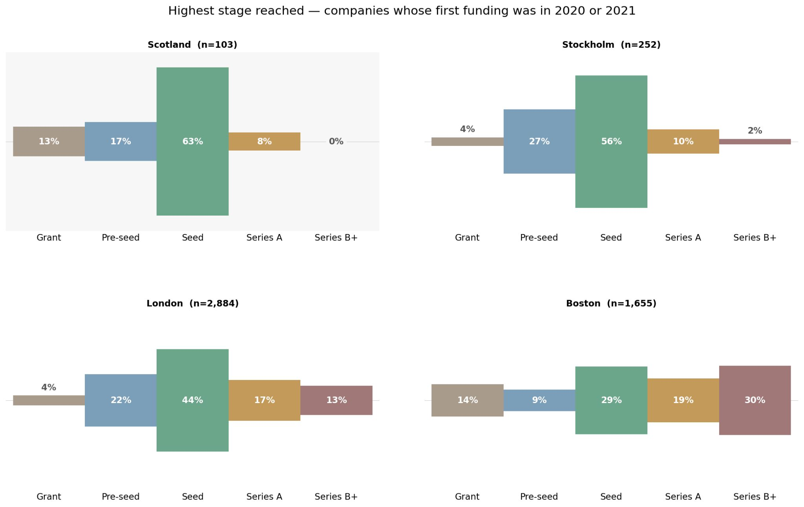

Over the past few months, I've been looking at the Scottish startup and scaleup ecosystem with the intent of understanding why Scotland is so very good at producing startups but so poor at scaling them. 

A while ago I posted the results of an analysis on LinkedIn showing the highest stage that companies that show up in Crunchbase eventually go on to reach.

As you can see, Scotland does well up until Seed, but few companies progress to Series A and beyond. There are many potential structural reasons for this phenomenon. Most recently, I've been thinking about the role of community knowledge.

A little while ago, I was chatting to a serial startup operator and founder. We were comparing notes about his experience in San Francisco, mine in Boston, and how both differ from Scotland. They mentioned that when you do something as simple as going out for coffee in one of the more mature ecosystems, you could well get into a conversation with an experienced operator and subsequently learn a new thing or two. Over time, that retained community knowledge results in a sort of education by osmosis.

So last week, I was speaking with a successful founder who runs a thriving business but has not yet had their first exit. I asked them what it would take for them to be involved in mentoring up and coming entrepreneurs. They told me that once they'd exited, they'd enjoy being a non-exec, but as for being involved in the wider community, they saw little point. They didn't feel like there was much of an opportunity to make an impact because they didn't get much benefit from the community themselves.

Community knowledge is a missing piece in the Scottish ecosystem. Building a startup that becomes a scaleup requires a specific set of skills. Without adequate recycling of that expertise, it is very difficult for new entrepreneurs to learn how to think about their businesses, to know what questions to ask, how to find answers, what to look for when making early hires and what other help they need.

Keeping founders engaged with the community as they become successful is a real challenge. It's worth asking how we create communities that provide enough value at all stages of the journey that successful founders feel both willing and able to pass on their knowledge. 