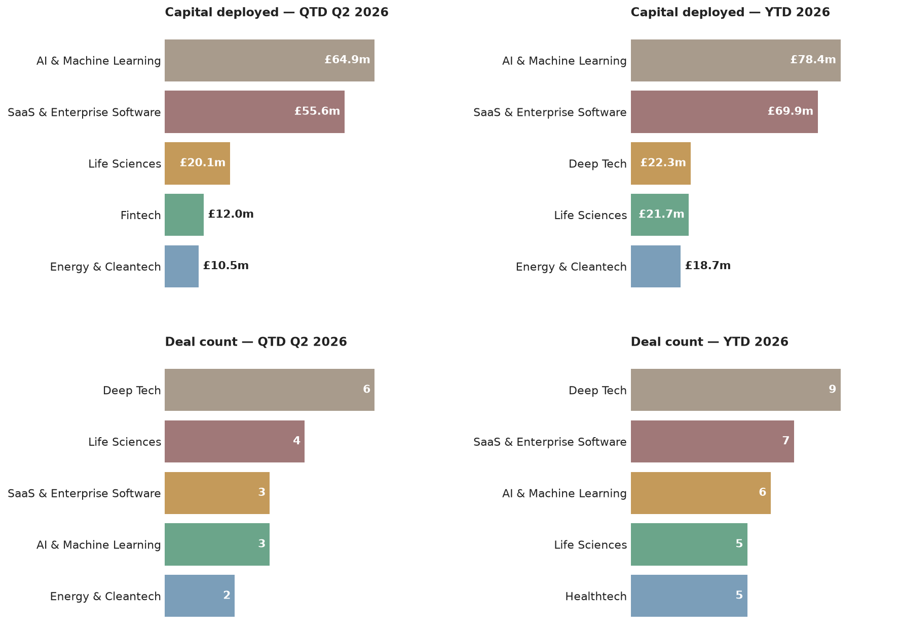

# Scottish VC Tracker — 8 June 2026
*This is an automated newsletter, written by Claude, based on news coverage scraped from 32 websites.*

## This Week

- A £200k pre-seed round for Edinburgh's Swurf, a remote-working platform connecting workers to on-demand private meeting pods, surfaced this week via Daily Business Group and Scottish Financial News — the round actually closed back in March, backed by Skyscanner co-founder Gareth Williams among other angels.
- A £2.6m growth round for Edinburgh's Esk, an entertainment technology company building live experiences for brands including Netflix and BAFTA, also surfaced this week — it was led by Maven Capital Partners back in May, via the Investment Fund for Scotland.

## The Numbers

This is the first issue, so here's where things stand: **Q2 2026** has seen **19 deals worth £107.5m**, with the year to date at **29 deals worth £141.6m**.

Tricapital is the most active investor by deal count this quarter with 4 (its angel syndicate backed HonuWorx, Kaly and Sisaltech in a single announcement), followed by Scottish Enterprise Investment Fund with 3 and a tie between Maven Capital Partners and STAC Invest at 2 each. By capital, Index Ventures and Highland Europe are tied at the top with £51.9m each — both backed Wordsmith AI's Series B — ahead of Scottish Enterprise Investment Fund's £22.5m spread across three deals. Seed is the dominant stage this quarter, with Growth-stage deals (mostly Tricapital's smaller angel cheques) close behind Pre-Seed. AI & Machine Learning and SaaS & Enterprise Software lead on capital deployed, driven largely by the Wordsmith AI and Aveni rounds, while Deep Tech leads on deal count thanks to Tricapital's multi-company angel cheques — a split worth noting, since the biggest-money sectors aren't the most active ones by number of deals. Edinburgh accounts for the largest share of deals by location, with Glasgow and the rest of Scotland trailing some way behind.

## Deal Spotlight

### Wordsmith AI — Series B — £51.9m ($70m)
**Lead investor**: Highland Europe · **Co-investors**: Index Ventures · **Sector**: AI & Machine Learning, SaaS & Enterprise Software · **Location**: Edinburgh

Wordsmith is an Edinburgh-based legal AI startup building an operations platform for in-house legal teams. The round, announced as €60.2m ($70m), brings the company's total funding to €86m ($100m) and was led by Highland Europe with participation from Index Ventures. Wordsmith says it's now used by more than 500 companies, including BT, the Financial Times, Safelite, Trip.com and Canva.

Source: eu-startups.com (https://www.eu-startups.com/2026/06/edinburgh-based-wordsmith-raises-e60-2-million-series-b-to-scale-legal-ai-platform-for-in-house-teams/)

### Aveni — Growth — £12m
**Lead investor**: PXN Ventures · **Co-investors**: Puma Growth Partners, Lloyds Banking Group, Nationwide, Scottish Enterprise Investment Fund · **Sector**: Fintech, AI & Machine Learning · **Location**: Edinburgh

Aveni, a University of Edinburgh spinout building AI tools for wealth management, financial advice and banking, raised £12m led by PXN Ventures, with existing backers Puma Growth Partners, Lloyds Banking Group, Nationwide and Scottish Enterprise all returning. The funding will go toward Aveni's Unified Assurance Platform and two new products, Agent Assure and Agent Approve. Two high-street banks backing the same round is a notable detail for a company still at growth stage rather than a later round.

Source: scottishfinancialreview.com (https://scottishfinancialreview.com/2026/06/04/aveni-edinburgh-ai-wealth-startup-raises-12m/)

## Sources

- **Swurf**: [Daily Business Group](https://dailybusinessgroup.co.uk/2026/03/gibson-raises-200k-to-expand-swurf-platform/), [scottishfinancialnews.com](https://www.scottishfinancialnews.com/articles/funding-round-worth-ps200k-to-help-scottish-startup-make-edinburgh-most-flexible-working-capital)
- **Esk**: [mavencp.com](https://www.mavencp.com/latest-news/maven-leads-2.6-million-funding-round-in-esk)

## Notes

Both deals surfacing this week were old news by the time we found them — Swurf's £200k round closed in March and Esk's £2.6m round in May. Neither reflects a current lull in deal activity; see The Numbers above for the actual run-rate this quarter.
