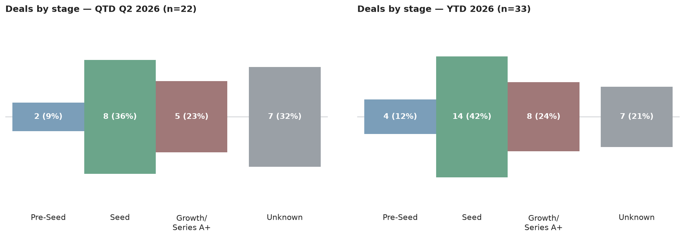
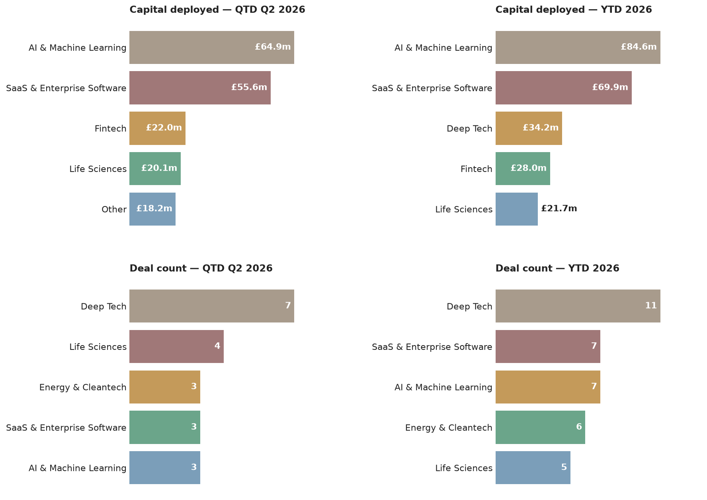

# Scottish Venture News — 6 July 2026

*This is an automated newsletter, written by Claude, based on news coverage scraped from 46 websites.*

## What We Found This Week

Here are the deals we saw reported in the press this week, ordered by the announcement date.

- **BR-DGE** closed a £10m growth round from new investor Bettor Capital, alongside continued backing from Greyfriars — 30 June.
  *Source: [Crunchbase](https://www.crunchbase.com/discover/funding_rounds/e3120c30307a4df552a2e1c7559da4a2), [Startup Mag](https://www.startupmag.co.uk/funding/brdge-2026-growth-funding/)*
- **VASO Global** picked up a £1.4m seed cheque from PXN Ventures, part of a wider £5m+ package that also included £621k from Scottish Enterprise, a UKRI-backed loan, and funding from Eco Group — 30 June.
  *Source: [Bdaily](https://bdaily.co.uk/articles/2026/06/30/vaso-secures-funding-to-accelerate-growth), [DIGIT.fyi](https://www.digit.fyi/digit-deal-roundup-june-2026/), [PXN Ventures](https://www.pxnventures.co.uk/5m-funding-boost-for-innovative-construction-business-vaso-global/)*
- **Aveni** raised £12m led by PXN Ventures, with Puma Growth Partners, Lloyds Banking Group, Nationwide and Scottish Enterprise also taking part — round stage not disclosed by the source — 4 June.
  *Source: [Edinburgh Innovations](https://edinburgh-innovations.ed.ac.uk/news/fintech-startup-aveni-announces-12m-raise), [Scottish Financial Review](https://scottishfinancialreview.com/2026/06/04/aveni-edinburgh-ai-wealth-startup-raises-12m/), [Crunchbase](https://www.crunchbase.com/discover/funding_rounds/e3120c30307a4df552a2e1c7559da4a2), [DIGIT.fyi](https://www.digit.fyi/digit-deal-roundup-june-2026/), [PXN Ventures](https://www.pxnventures.co.uk/aveni-extends-market-leading-wealth-and-compliance-platform-with-12m-raise/)*
- **Vuabl** picked up £222k from STAC Invest, part of the Glasgow accelerator's second investment round backing a three-company cohort — 1 April.
  *Source: [BusinessCloud](https://businesscloud.co.uk/live-blog/stac-backs-three-scottish-deeptech-companies/), [STAC](https://www.stac.ac/stac-backs-three-scottish-deep-tech-companies-in-our-second-investment-round/)*
- **Airspection** picked up £300k from STAC Invest in the same second-round cohort investment — 1 April.
  *Source: [BusinessCloud](https://businesscloud.co.uk/live-blog/stac-backs-three-scottish-deeptech-companies/), [STAC](https://www.stac.ac/stac-backs-three-scottish-deep-tech-companies-in-our-second-investment-round/)*

## The Numbers

Q3 2026 has just begun, and no deals have yet been announced with a third-quarter date — so the quarter stands at **0 deals worth £0m** for now. Zooming out, the year to date stands at **33 deals worth £171.32m**, up one deal and around £13.4m since the last issue — driven by this week's new rounds for BR-DGE and VASO Global, plus the earlier-dated deals for Aveni, Vuabl and Airspection that came to light this week.

There's no quarter-to-date investor activity yet to rank, this early in Q3. Looking at the year so far, Seed remains the dominant stage (14 of 33 deals), with Growth (5) and Pre-Seed (4) also featuring. Four rounds carry no stated stage, one — Aveni's £12m raise — was explicitly not disclosed by its source, and two — Vuabl and Airspection — fall under STAC's second-round cohort investment, while Series A and Series B stay rare at 2 and 1 respectively. Deep Tech leads the sector mix with 11 deals, just ahead of SaaS & Enterprise Software (7) and AI & Machine Learning (7), with Energy & Cleantech, Life Sciences and Healthtech (5-6 each) rounding out a broad, deeptech-and-energy-led year for Scottish venture activity.

## Deal Spotlight

### Aveni — £12m funding round
**Lead investor**: PXN Ventures · **Co-investors**: Puma Growth Partners, Lloyds Banking Group, Nationwide, Scottish Enterprise Investment Fund · **Sector**: AI & Machine Learning, Fintech · **Location**: Edinburgh

Aveni builds AI tools for wealth managers and banks, including a Unified Assurance Platform that reviews conduct and compliance risk in customer interactions. The £12m round was led by PXN Ventures, with continued backing from Puma Growth Partners, Lloyds Banking Group, Nationwide and Scottish Enterprise; none of the coverage states what stage the round was. The funding will go toward new products that assess the conduct risk of AI agents operating in financial services — a niche created by banks' own growing use of AI.

Source: [Edinburgh Innovations](https://edinburgh-innovations.ed.ac.uk/news/fintech-startup-aveni-announces-12m-raise)

### BR-DGE — Growth — £10m
**Lead investor**: Bettor Capital · **Co-investors**: Greyfriars · **Sector**: Fintech · **Location**: Edinburgh

BR-DGE runs a payments orchestration platform for enterprise merchants in gaming and online retail, and will use the funding for international expansion and platform development. The round brought in Bettor Capital, a US gaming-focused specialist investor, as a new backer — its first Scottish deal — alongside continued support from long-time advisor Greyfriars. The raise coincided with the appointment of Perry Blacher as chairman.

Source: [Startup Mag](https://www.startupmag.co.uk/funding/brdge-2026-growth-funding/)

## Sources

- **BR-DGE**: [Crunchbase](https://www.crunchbase.com/discover/funding_rounds/e3120c30307a4df552a2e1c7559da4a2), [Startup Mag](https://www.startupmag.co.uk/funding/brdge-2026-growth-funding/)
- **VASO Global**: [Bdaily](https://bdaily.co.uk/articles/2026/06/30/vaso-secures-funding-to-accelerate-growth), [DIGIT.fyi](https://www.digit.fyi/digit-deal-roundup-june-2026/), [PXN Ventures](https://www.pxnventures.co.uk/5m-funding-boost-for-innovative-construction-business-vaso-global/)
- **Aveni**: [Edinburgh Innovations](https://edinburgh-innovations.ed.ac.uk/news/fintech-startup-aveni-announces-12m-raise), [Scottish Financial Review](https://scottishfinancialreview.com/2026/06/04/aveni-edinburgh-ai-wealth-startup-raises-12m/), [Crunchbase](https://www.crunchbase.com/discover/funding_rounds/e3120c30307a4df552a2e1c7559da4a2), [DIGIT.fyi](https://www.digit.fyi/digit-deal-roundup-june-2026/), [PXN Ventures](https://www.pxnventures.co.uk/aveni-extends-market-leading-wealth-and-compliance-platform-with-12m-raise/)
- **Vuabl**: [BusinessCloud](https://businesscloud.co.uk/live-blog/stac-backs-three-scottish-deeptech-companies/), [STAC](https://www.stac.ac/stac-backs-three-scottish-deep-tech-companies-in-our-second-investment-round/)
- **Airspection**: [BusinessCloud](https://businesscloud.co.uk/live-blog/stac-backs-three-scottish-deeptech-companies/), [STAC](https://www.stac.ac/stac-backs-three-scottish-deep-tech-companies-in-our-second-investment-round/)

## Notes

A few of the deals above were actually announced weeks or months before they turned up in our search this week — Vuabl and Airspection's STAC Invest cheques date back to April, and Aveni's £12m raise to early June. That's a reflection of when these deals came to light rather than any lull in Scottish dealmaking — see The Numbers above for the current run-rate.
