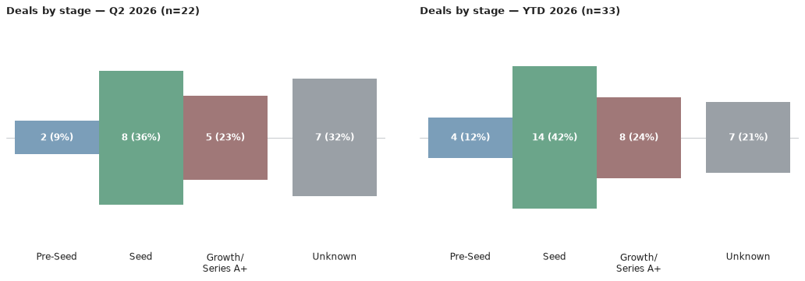
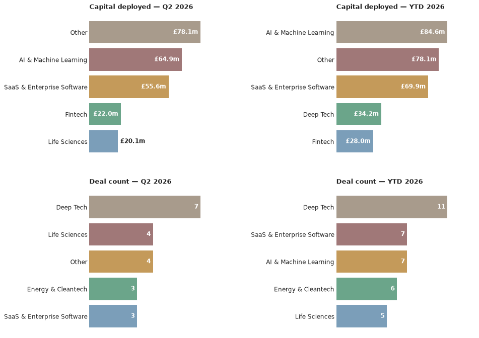

# Scottish Venture News — 13 July 2026

*This is an automated newsletter, written by Claude, based on news coverage scraped from 46 websites.*

## What We Found This Week

No new deals came to light in Scottish venture news this week — the market's most recent confirmed activity remains the rounds covered in last week's issue.

## The Numbers

Q3 2026 has yet to record its first deal — the quarter stands at **0 deals worth £0m**, unchanged from last week. The year to date holds at **33 deals worth £157.3m**. The deal count is unchanged since the last issue, but the capital figure is down from the £171.3m stated previously: Ardgowan Distillery's raise was previously overstated at £18.2m — that figure included the conversion of existing loan notes to equity, not new investment; the actual round was £4.2m, which is what's now reflected in the year-to-date total.

There's no quarter-to-date investor activity yet to rank. Q2 2026 was Seed-heavy — 8 of the quarter's 22 deals — with Growth (4) and a scattering of Pre-Seed, Series B and 2nd Round rounds behind it. Deep Tech was the most active sector by deal count (7), with SaaS & Enterprise Software, AI & Machine Learning and Property & Construction Tech (3 each) also drawing repeat interest; by capital, AI & Machine Learning (£64.9m) and SaaS & Enterprise Software (£55.6m) pulled in by far the most funding, well ahead of Deep Tech (£15.5m) and Fintech (£22m). Looking at the year so far, Seed remains the dominant stage overall (14 of 33 deals), and Deep Tech the most frequent sector (11).

## Deal Spotlight

### Wordsmith AI — Series B — £51.9m
**Lead investor**: Highland Europe · **Co-investors**: Index Ventures · **Sector**: AI & Machine Learning, SaaS & Enterprise Software · **Location**: Edinburgh

Wordsmith AI builds a legal operations platform for in-house legal teams, handling contract workflow and review. The Edinburgh company's $70m Series B (~£51.9m) was led by Highland Europe, with continued backing from existing investor Index Ventures, taking its total funding to around $100m. Coverage of the round spanned multiple outlets over June, from an initial write-up on Future Scot to mentions in the Campfire Scotland newsletter, DIGIT.fyi's deal roundup and EU-Startups.

Source: [Future Scot](https://futurescot.com/edinburgh-legal-ai-startup-raises-52-million-in-series-b-funding-round/)

## Notes

It's been a quiet week for new press coverage, not for Scottish dealmaking — the same rounds covered last week remain the latest confirmed activity, and the year-to-date total above still reflects a steady pace for 2026.
