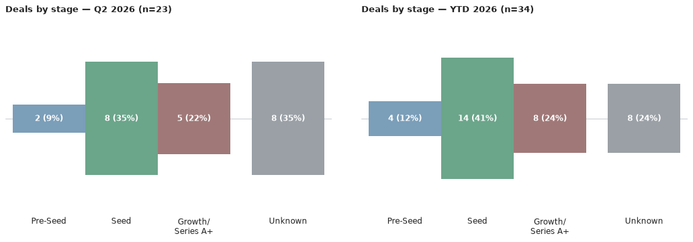
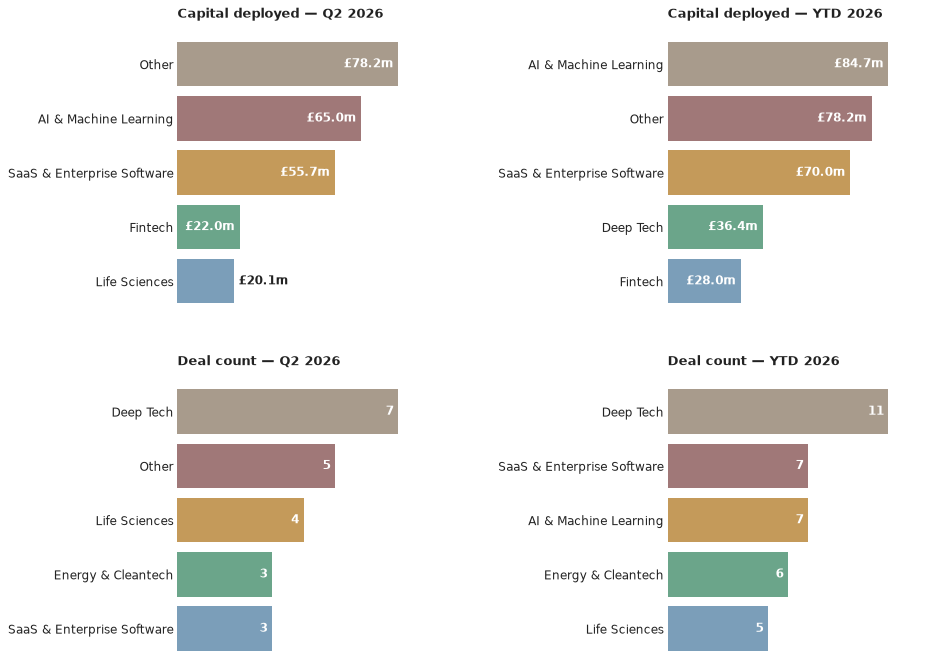

# Scottish Venture News — 20 July 2026
*This is an automated newsletter, written by Claude, based on news coverage scraped from 44 websites.*

## Editor's Note

Last Thursday I attended the Signals briefing event at CodeBase. Signals is a new investment programme from Techstart Ventures, aimed at helping pre-seed companies become more investment-ready.

As Robert Gelb, representing Techstart, explained, the idea comes from a change in what investors are looking for. A few years ago, a strong idea and a good team might have been enough. Increasingly, investors want more developed products and evidence of market traction.

Techstart are addressing that by giving entrepreneurs ongoing peer accountability, regular co-working, and challenge from investors and experienced operators. They also use a warrantied SAFE note, keeping things simple and avoiding the need for an early valuation.

I think Techstart are a great company and I really like the Signals idea, but the interesting discussion came afterwards in the Q&A.

A conversation developed around the different routes founders can take to fund a high-growth business, and the implications of those choices. At one point I said that not all money is fungible - which sounds ridiculous, given that fungibility is part of the definition of money - but bear with me.

For a founder, raising venture capital is usually the start of a 7–10 year relationship. Your investors will be co-owners and business partners, so choosing them carefully matters. Who you choose to partner with says something about your business, and future investors will pay close attention to who is already on the cap table.

It's not about good money or bad money. It's about finding the right investors for your business. That might be about their sector expertise, the terms they offer, their ability to support you, or simply whether you trust each other and can work together.

Venture money isn't really fungible because it comes with more than capital. It comes with a partnership. Choose your partners carefully.

## What We Found This Week

Here are the deals we saw reported in the press this week, ordered by the announcement date.

It was a quiet week for fresh dealflow — both additions below are catch-up entries on older, previously unreported rounds rather than brand-new announcements. See Notes for more on that, and The Numbers for a fuller picture of Q2 activity.

- **Nu-Style Products** — Private Equity — amount undisclosed — led by LDC — 22 June 2026
  *Source: [Crunchbase](https://www.crunchbase.com/discover/funding_rounds/e3120c30307a4df552a2e1c7559da4a2)*
- **Amytis** — Grant match-funding — amount undisclosed — led by Bethnal Green Ventures — date not confirmed
  *Source: [Sifted](https://sifted.eu/articles/incubator-scotland-next-generation-of-tech-brnd/)*

## The Numbers

Q3 2026 hasn't produced a deal yet — **0 deals worth £0m** so far, unchanged since last week's issue. The year-to-date total moves to **34 deals worth £159.6m**, up one deal and £2.33m since last issue. The extra deal is Nu-Style Products' private equity round, added to the record this week; Amytis' grant match-funding carries no confirmed date, so it doesn't count towards either total. Neither of this week's additions discloses a size, so the £2.33m rise in the year's capital figure comes from a revision to an already-counted round elsewhere in the total, not from anything new above.

Q3 2026 hasn't produced a deal yet, so there's no investor to rank this quarter.

The charts above cover Q2 2026, the most recent quarter with completed deals: Seed was the dominant stage (8 of 23 deals), with Growth and a scatter of second-round and undisclosed-stage rounds filling out the rest. Deep Tech led by sector with 7 deals, well ahead of Life Sciences (4) and a three-way tie between SaaS & Enterprise Software, AI & Machine Learning and Energy & Cleantech (3 apiece) — AI & Machine Learning and SaaS also topped the capital tables, at £65.0m and £55.7m respectively, reflecting Wordsmith's and Aveni's large rounds.

## Deal Spotlight

### BR-DGE — Growth — £10m
**Lead investor**: Bettor Capital · **Co-investors**: Greyfriars · **Sector**: Fintech · **Location**: Edinburgh

BR-DGE, a payments orchestration platform for enterprise merchants in gaming and online retail, raised £10m in a growth round from Bettor Capital, a US gaming-focused specialist making its first recorded Scottish investment, with continued backing from long-time advisor Greyfriars. The round, announced 30 June 2026, coincided with the appointment of Perry Blacher as chairman. Funds are earmarked for international expansion and platform development.

Source: [Crunchbase](https://www.crunchbase.com/discover/funding_rounds/e3120c30307a4df552a2e1c7559da4a2), [Startupmag](https://www.startupmag.co.uk/funding/brdge-2026-growth-funding/)

## Sources

- **Nu-Style Products**: [Crunchbase](https://www.crunchbase.com/discover/funding_rounds/e3120c30307a4df552a2e1c7559da4a2)
- **Amytis**: [Sifted](https://sifted.eu/articles/incubator-scotland-next-generation-of-tech-brnd/)

## Notes

Both entries added this week are older rounds surfacing late rather than fresh news. Nu-Style Products' private equity deal was actually announced back on 22 June, led by LDC — the size hasn't been made public, so it's counted here as a confirmed but undisclosed-amount deal. Amytis' funding is a grant match-funding arrangement from Bethnal Green Ventures rather than a straightforward equity round, the underlying piece doesn't give a date for it, and it should be treated as unconfirmed pending a clearer source.

Q3 2026's empty deal count reflects that lag in when things surface rather than an actual pause in Scottish dealmaking — for the real run rate, Q2 2026's 23 deals worth £125.6m (shown in the charts above) is the better current picture.
