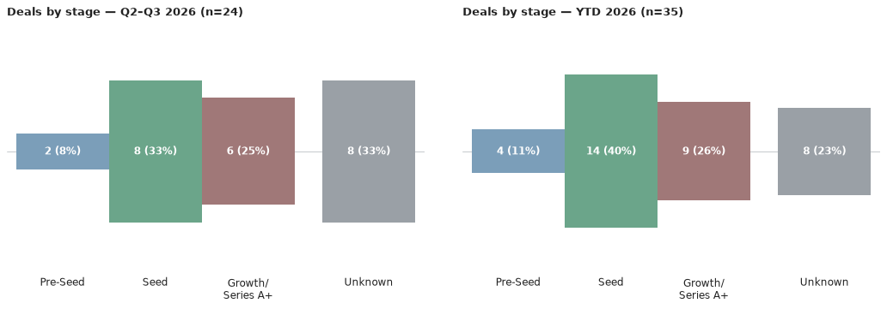
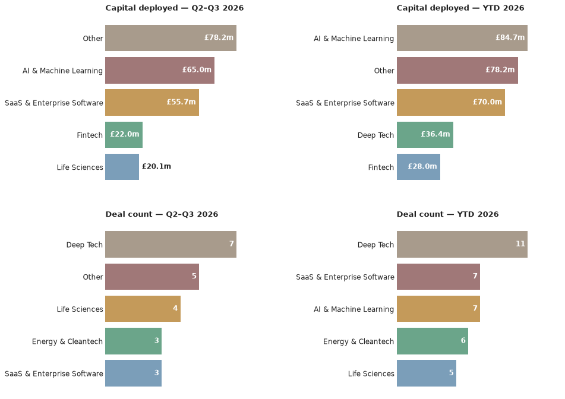

# Scottish Venture News — 27 July 2026

*This is an automated newsletter, written by Claude, based on news coverage scraped from 43 websites.*

## Editor's Note

When assessing your startup, what VCs fundamentally care about is whether they will get a return on their investment. For that to happen, you have to be successful.

VC firms aren't charities, and they're not academic funders. They're businesses with a distinct set of incentives. The partner you're talking to isn't just a person with access to money, looking to give it away as a reward to somebody with a clever idea. They're usually funded by institutional investors, like pension funds, and face real consequences if they don't make returns.

Success rates aren't particularly high. In the UK, 70% of VC funds (2002–2020 vintages) haven't yet distributed more cash to investors than was paid in, and only 5% have distributed more than 3x their capital back.* Adding further pressure, it's common for VC partners to invest their own money. Considering the level of skin in the game helps explain the VC worldview and perspective.

Many of the pressures on VCs and entrepreneurs are similar, just at a different scale. Think about choosing a co-founder, or making your first hire. Skills, background, credentials are all important, but the real test is how you get on face to face. The questions most people ask themselves are: 'Do I trust this person with this thing that's really important to me?', 'Are they committed?', 'Will they push through when the going gets tough, or fold?'

So when a VC is looking at a startup, they care about the problem, the product, the total addressable market, and all of that stuff you've put in your pitch decks. They care more about the people who are going to drive the company forward and make it grow. That's you, as founder, and it's the rest of the team too, especially anyone holding equity. They're going to ask themselves if you're the person that's going to turn this problem into a high-growth business. They're going to ask why you started the company, and what makes you the person who's going to succeed where others have failed. In short, they're asking themselves if they trust you with the money they're responsible for.

Last week I made the point that entrepreneurs need to be careful when choosing an investor because it's a long-term partnership with real consequences. That cuts both ways.

/* Morrison, Ben, George Buckle, and British Business Bank Economics Team. UK Venture Capital Financial Returns 2025. Annual report. British Business Bank, 2025.

## What We Found This Week

Here are the deals we saw reported in the press this week, ordered by the announcement date.

- **Xburo UK** took on an undisclosed growth investment from Chiltern Capital, announced 23 July 2026.
  *Source: [The Herald](https://www.heraldscotland.com/news/26403951.glasgow-firm-xburo-reveals-uk-hopes-investment-deal/?ref=rss)*

## The Numbers

Q3 2026 stands at **1 deal** so far — Xburo UK's undisclosed growth investment from Chiltern Capital — taking the year to date to **35 deals worth £159.6m**. That's one more deal in both the quarter and year-to-date count than last week's issue, with no change to confirmed capital since the round's amount wasn't disclosed.

Chiltern Capital is the only investor behind a Scottish deal so far this quarter, backing Xburo UK — it's early days for Q3, with just the one deal on the board: a Glasgow-based engineering consultancy raise.

## Deal Spotlight

### Xburo UK — Growth — Undisclosed
**Lead investor**: Chiltern Capital · **Co-investors**: none named · **Sector**: Engineering consultancy · **Location**: Glasgow

Xburo UK is a mechanical, electrical and public health (MEPH) engineering consultancy founded in 2018, operating from offices in Glasgow and Edinburgh and serving more than 60 clients. London private investment firm Chiltern Capital has backed the company to fund its expansion across the UK; the investment amount was not disclosed. Xburo called the deal a "clear statement of intent" as it targets becoming a leading national specialist in MEPH asset engineering, design and technical advisory.

Source: [The Herald](https://www.heraldscotland.com/news/26403951.glasgow-firm-xburo-reveals-uk-hopes-investment-deal/?ref=rss)

## Sources

- **Xburo UK**: [The Herald](https://www.heraldscotland.com/news/26403951.glasgow-firm-xburo-reveals-uk-hopes-investment-deal/?ref=rss)
