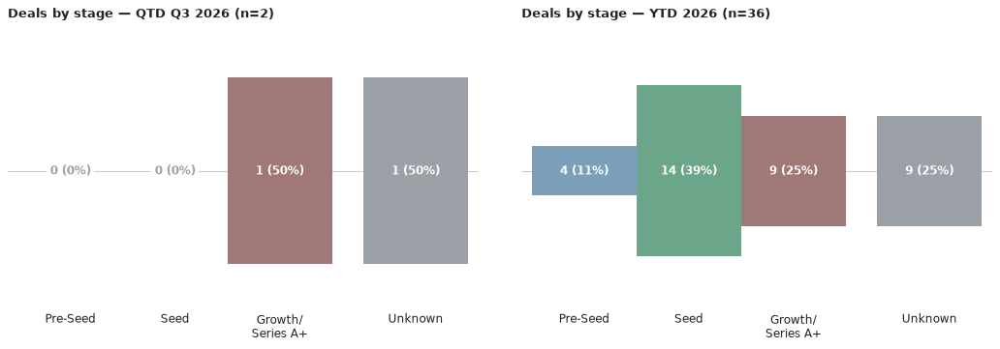
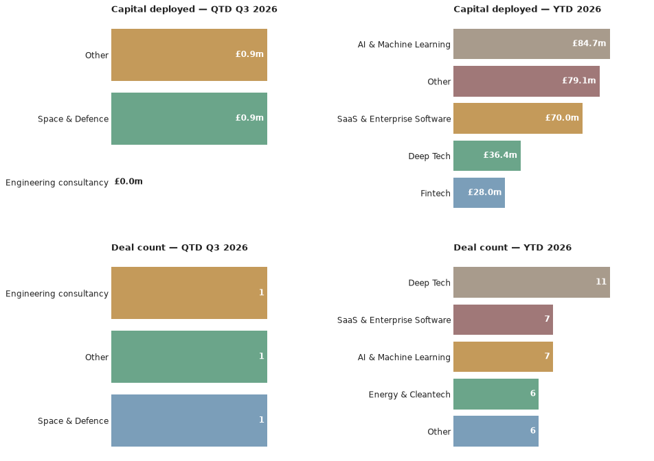

# Scottish Venture News — 3 August 2026

*This is an automated newsletter, written by Claude, based on news coverage scraped from 44 websites.*

## Editor's Note

From now on, Scottish Venture news will go out monthly on the first Monday of the month.

Last week I talked about why VCs care so much about who's driving the company. This week, I'm going to talk about another frequent holder of equity: Universities.

If you're spinning a company out of a university, the tech transfer office is an important partner, but it also has its own incentives. Often, there is a tension between the need to protect the institution's IP and generate a return and the ability of the spinout to raise growth funding down the line.

A hard truth is that investors prefer companies in which more of the equity is held by people or organisations that are working to make the company successful moving forward, irrespective of who may have contributed in the past. According to the EU discussion paper for the Development of an EU Blueprint for IP Licensing and Spinoff Creation (2026), equity retention above 25% makes spinouts uninvestible unless the institution is continuing to add significant value and be a 'venture builder'. The same paper recommends a 'landing zone' of between 2-15% with low to no royalties.

The guidance is based on policy convergence across Europe, including the UK. The UK's TenU USIT Guide already makes almost the same recommendation. Then there's Germany's Spinoff Framework (backed by SPRIND's IP Scorecard and IP.Deals platform), the Netherlands' national IP deal terms, Switzerland's ETH Zurich express licence model, and Denmark's Guide to University Standard Licensing, all of which call for less equity retention and simpler terms.

So why would high equity retention matter so much? As a recent investor once asked me 'Why can't it just be diluted out?'. The problem is that founder equity dilution compounds. A VC doing the maths on a cap table isn't judging the university for being greedy, it's judging whether there's enough left in the pot, after every future round, for the founders and team to still be motivated to grind through the next five years.

If you're spinning out, it's useful to know that Universities are being told by their funders that lower equity retention increases the chances of company success. Ask what the institution is actually contributing beyond the licence (capital, people, infrastructure). The level of equity that you get to take with you should be a fair reflection of the level of risk that you are taking.

Last week's point was that entrepreneurs need to choose investors carefully because it's a long-term partnership with real consequences. Your university is a partner too. Negotiate it like one.

*Discussion Paper for the Development of an EU Blueprint for IP Licensing and Spinoff Creation, European Commission DG Research & Innovation, 2026.

## What We Found This Week

Here are the deals we saw reported in the press this week, ordered by the announcement date.

- **Quickblock** (Stirling) raised £940k in combined equity and grant funding, led by Equity Gap alongside the University of Strathclyde (via Strathclyde Inspire) and the Scottish Enterprise Investment Fund — 23 July 2026.
  *Source: [Scottish Enterprise Newsroom](https://www.scottish-enterprise-mediacentre.com/news/quickblock-secures-gbp-940-000-to-scale-defence-infrastructure-solutions-across-europe), [crunchbase.com](https://www.crunchbase.com/discover/funding_rounds/e3120c30307a4df552a2e1c7559da4a2)*

*Correction: an earlier version of this issue also listed "Xburo" as a second new deal this week. That was the same Xburo UK growth investment from Chiltern Capital already reported in the 27 July issue, picked up here from a second source (Scottish Business News) under a slightly different company-name spelling. It's been merged into the existing ledger record rather than counted as a separate deal — see the corrected figures below. The second source has been added to that deal's citations.*

## The Numbers

Q3 2026 stands at **2 deals worth £0.9m** so far, taking the year-to-date total to **36 deals worth £164.2m**. That's up on the last issue by 1 deal and £0.9m for the quarter, and by 1 deal and £4.5m for the year — Quickblock's £940k raise, above, accounts for the added deal, with the rest of the year-to-date capital move reflecting updates to figures already on the books from earlier in the year.

- By deal count: Chiltern Capital, Equity Gap, the Scottish Enterprise Investment Fund and the University of Strathclyde (via Strathclyde Inspire) are tied at one deal each.
- By capital deployed: Equity Gap, the Scottish Enterprise Investment Fund and the University of Strathclyde are tied at the top with £940k apiece — all three co-invested in the same Quickblock round; Chiltern Capital's deal was for an undisclosed amount.

The quarter's two deals split evenly by stage so far — Xburo UK's growth-stage engineering-consultancy investment from Chiltern Capital, and Quickblock's defence-infrastructure raise. Glasgow and Stirling have each hosted one of the two deals this quarter; Edinburgh hasn't had one yet.

## Deal Spotlight

### Quickblock — Equity & Grant Funding — £940k
**Lead investor**: Equity Gap · **Co-investors**: University of Strathclyde (Strathclyde Inspire), Scottish Enterprise Investment Fund · **Sector**: Space & Defence · **Location**: Stirling

Quickblock makes rapidly deployable modular infrastructure for defence, security and humanitarian use — the kind of quick-assembly shelters used by military and disaster-response teams. It closed a £940,000 round combining new equity investment with innovation grant funding: the equity portion was led by Edinburgh's Equity Gap alongside the University of Strathclyde (via its Strathclyde Inspire fund) and the Scottish Enterprise Investment Fund, while separate grant funding came from Scottish Enterprise and Innovate UK. The company says the money will go toward European expansion, added commercial capacity and production capability, pointing to rising NATO defence spending as a tailwind.

Source: [Scottish Enterprise Newsroom](https://www.scottish-enterprise-mediacentre.com/news/quickblock-secures-gbp-940-000-to-scale-defence-infrastructure-solutions-across-europe)

## Sources

- **Quickblock**: [Scottish Enterprise Newsroom](https://www.scottish-enterprise-mediacentre.com/news/quickblock-secures-gbp-940-000-to-scale-defence-infrastructure-solutions-across-europe), [crunchbase.com](https://www.crunchbase.com/discover/funding_rounds/e3120c30307a4df552a2e1c7559da4a2)
- **Xburo UK** (see correction above — not a new deal this week): [Scottish Business News](https://scottishbusinessnews.net/business-advisers-hailed-as-engineering-firm-secures-investment-for-major-expansion/)

## Notes

It was a quiet week for new announcements — just one new deal surfaced, Quickblock, dated 23 July. A second source on Xburo UK's growth investment (already reported in the 27 July issue) also came in this week — see the correction above. See The Numbers above for the actual run-rate this quarter.

Quickblock's deal carries medium confidence. Its £940k package blends new equity with public grant funding — Equity Gap led the equity portion specifically, with Scottish Enterprise and Innovate UK grant money making up the rest.
