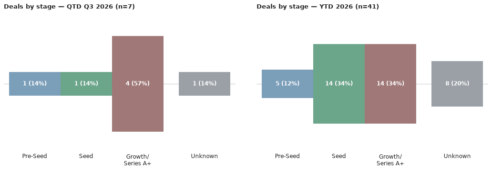
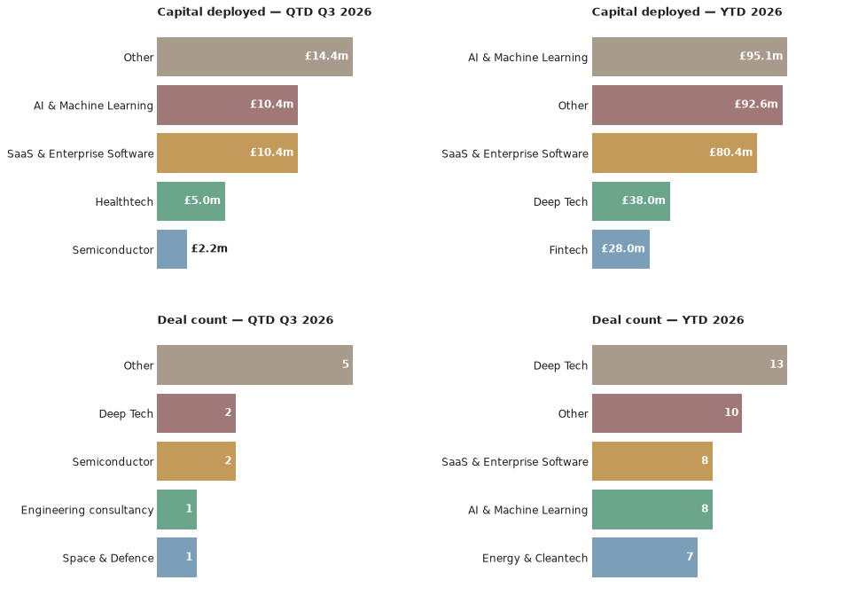

# Scottish Venture News — 7 September 2026
*This is an automated newsletter, written by Claude, based on news coverage scraped from 45 websites.*

## Editor's Note

Welcome to the first monthly edition of Scottish Venture news. When the last issue went out, the fringe was just getting started and now it's all over. If you live here in Edinburgh or came in to visit, I hope you saw some great stuff. As the Scotland and its capital city shifts gears into the new academic year, I hope we see some interesting spinouts and startups emerging from our universities.

In the news this past week, there's been a change in Scotland's government. Alyn Smith, who was elected as MSP for Stirling this year, after previously representing Stirling as an MP, and Scotland as an MEP before that, has been appointed Minister for Innovation, Technology and Tertiary Education, following Ben Macpherson's resignation in August. When the FM announced the appointment, he stated that "supporting university research and spin-outs, and connecting business with academic institutions to drive innovation and growth" is a priority for the government. So, here's hoping we see policy changes that better support spinouts and startups that originate from both the university sector and elsewhere.

If the government is going to do a better job of helping potential high growth companies achieve scale, they're going to need to get across the details of a fast moving, changing landscape. We're all aware of the big trends that everybody talks about on places like LinkedIn. Investors are moving away from SaaS, there's a rush of money into AI, life sciences, deep tech and defence. That's all good to know and strategically useful, but I've always found that the insights hidden in the data are where you find the advantage.

For example, did you know that aggregated across all sectors, the median time between a seed round and a Series A is slowly expanding? In 2021, it was about 1.2 years, but by Q4 2024, it had grown to 774 days*. If you break it down by sector, though, the picture is far from uniform. SaaS is running faster, fintech considerably slower. That's a bit counter-intuitive, given the way the market is moving until you realise that in lower investor confidence rounds can be smaller and more frequent as investors seek financial milestone gating.

The overarching trend, however, is for slower cycles. This has implications for how high growth companies need to be advised and supported. When entrepreneurs learn how to pitch to investors, they need to take on board many more specifics about what's happening in their sector, market and geography than many people appreciate. What was true 3 years ago may not be true today and what's true for a SaaS company, a fintech, or a gaming company won't be true for AI, deep tech or defence.

With things changing so fast, there's also a need to accept adaptation. Sometimes, a bridge or extension round is seen as a sign that things aren't going to plan but that's not a fair interpretation if the environment is materially changing. According to Carta, of companies that raised seed in early 2019, 44% had reached Series A within three years. For companies that raised seed in early 2022 that figure is 24%**. Things change.

That's the real work ahead for us all, including the new minister. We have a landscape that behaves differently across different sectors and changes rapidly over time, so we need government policies and programmes, a university sector, and investors that are nimble enough to cope with that. For those of us backing, advising, or building these companies, the job isn't so different. We must read the specifics of our sectors and stages before assuming that our assumptions are still valid.

*Kevin Dowd, "The typical time between VC rounds is shrinking in SaaS and rising in fintech," Carta, 19 March 2025. https://carta.com/uk/en/data/time-between-VC-rounds-2024/ (Nevermind the lead-burying headline)
**Carta, State of Seed: Winter 2025 (with a16z Speedrun), "Graduation rates to Series A improving slightly for recent cohorts." https://carta.com/data/resources/state-of-seed-2025/

## What We Found This Month

Here are the deals we saw reported in the press since the last issue, ordered by the announcement date.

- HexSeed Technology raised a £600k pre-seed round from Carbon13, Net Zero Technology Centre and Vento, announced 21 August 2026.
  *Source: [UKTN](https://www.uktech.news/funding/uk-tech-funding-roundup-this-weeks-deals-from-callosum-to-economad-20260821), [Crunchbase](https://www.crunchbase.com/organization/hexseed-technology)*
- Singular Photonics closed a £1.6m seed round led by ACF Investors, announced 19 August 2026.
  *Source: [UKTN](https://www.uktech.news/semiconductor/university-of-edinburgh-spinout-singular-photonics-secures-1-6m-20260819?utm_source=scottish%20enterprise&utm_medium=social&utm_term=linkedin&utm_content=7f228721-395e-4393-80ff-30872f342382&utm_campaign=se_web), [Crunchbase](https://www.crunchbase.com/organization/singular-photonics)*
- Kenoteq secured £900k, the first tranche of an ongoing £2m round, led by Kelvin Capital, announced 13 August 2026.
  *Source: [The Scotsman](https://www.scotsman.com/business/scottish-firm-behind-green-building-bricks-secures-ps900k-growth-backing-8918340), [Angel Capital Scotland](https://angelcapital.scot/deals/kenoteq-secures-just-under-900000-investment-to-accelerate-commercial-growth/), [Kelvin Capital](https://www.kelvincapital.com/2026/08/21/kenoteq-secures-just-under-900000-investment-to-accelerate-commercial-growth/), [Crunchbase](https://www.crunchbase.com/organization/kenoteq)*
- Wordsmith AI extended its Series B by $14m (£10.4m), led by new investor Intact Private Capital, announced 5 August 2026.
  *Source: [Scottish Financial Review](https://scottishfinancialreview.com/2026/08/06/ft-ventures-invests-as-wordsmith-ai-raises-14m/), [Crunchbase](https://www.crunchbase.com/organization/wordsmith), [Wordsmith AI](https://www.wordsmith.ai/blog/wordsmith-extends-series-b-with-investment-from-intact-private-capital-and-ft-ventures)*
- Regenerus Laboratories raised £5m in equity from Foresight Group, announced 14 July 2026.
  *Source: [Scottish Enterprise Newsroom](https://www.scottish-enterprise-mediacentre.com/news/regenerus-laboratories-secures-a-combined-gbp-8m-investment-to-expand-advance-diagnostic-testing-platform-internationally)*

## The Numbers

Q3 2026 stands at **7 deals worth £19.4m**, with **41 deals worth £182.7m** for the year to date. That's up from 2 deals worth £0.9m and 36 deals worth £164.2m respectively when the last issue went out — the jump is entirely down to the five rounds above: Wordsmith AI's $14m Series B extension, Kenoteq's £900k growth tranche, Singular Photonics' £1.6m seed round, HexSeed Technology's £600k pre-seed, and Regenerus Laboratories' £5m growth round from mid-July.

Most active by deal count this quarter: the Scottish Enterprise Investment Fund leads with two rounds worth £2.54m combined. Behind it, a four-way tie on one deal apiece — Highland Europe, FT Ventures, Intact Private Capital and Index Ventures — all backers of Wordsmith AI's extension round. By capital, that same four-way tie sits on top at £10.4m each, with Foresight Group next on £5.0m from its Regenerus Laboratories round.

Growth-stage rounds dominate the quarter — four of the seven deals — with the rest split across a Series B extension, a seed and a pre-seed. Semiconductor and Deep Tech are the only sectors to see more than one deal each, both tied to university-linked spinouts (Singular Photonics and HexSeed Technology). Edinburgh accounts for four of the seven deals, with one each in Glasgow, Aberdeen and elsewhere in Scotland.

## Deal Spotlight

### Wordsmith AI — Series B extension — $14m (£10.4m)
**Lead investor**: Intact Private Capital · **Co-investors**: FT Ventures, Highland Europe, Index Ventures · **Sector**: AI & Machine Learning, SaaS & Enterprise Software · **Location**: Edinburgh

Wordsmith AI builds an AI platform for in-house legal departments, serving over 500 enterprise customers including BT, FT, Sage and Canva. The Edinburgh-founded company brought in new investor Intact Private Capital and new backer FT Ventures for this extension, alongside follow-on money from existing shareholders Highland Europe and Index Ventures. The round takes its total Series B to $84m and lifetime funding to $114m, as the company reports 14x year-on-year revenue growth and pushes into North American financial services and insurance markets.

Source: [Wordsmith AI](https://www.wordsmith.ai/blog/wordsmith-extends-series-b-with-investment-from-intact-private-capital-and-ft-ventures)

### Singular Photonics — Seed — £1.6m
**Lead investor**: ACF Investors · **Co-investors**: Wren Capital, Cambridge Angels, Scottish Enterprise Investment Fund, Quantum Exponential, Old College Capital · **Sector**: Semiconductor · **Location**: Edinburgh

Singular Photonics, a University of Edinburgh spinout, closed an oversubscribed seed round to develop single-photon avalanche diode (SPAD) image sensors with on-chip computation, aimed at machine vision, industrial automation and medical imaging. The round drew six backers, led by ACF Investors alongside Wren Capital, Cambridge Angels, the Scottish Enterprise Investment Fund, Quantum Exponential and Old College Capital.

Source: [UKTN](https://www.uktech.news/semiconductor/university-of-edinburgh-spinout-singular-photonics-secures-1-6m-20260819?utm_source=scottish%20enterprise&utm_medium=social&utm_term=linkedin&utm_content=7f228721-395e-4393-80ff-30872f342382&utm_campaign=se_web)

## Sources

- **HexSeed Technology**: [UKTN](https://www.uktech.news/funding/uk-tech-funding-roundup-this-weeks-deals-from-callosum-to-economad-20260821), [Crunchbase](https://www.crunchbase.com/organization/hexseed-technology)
- **Singular Photonics**: [UKTN](https://www.uktech.news/semiconductor/university-of-edinburgh-spinout-singular-photonics-secures-1-6m-20260819?utm_source=scottish%20enterprise&utm_medium=social&utm_term=linkedin&utm_content=7f228721-395e-4393-80ff-30872f342382&utm_campaign=se_web), [Crunchbase](https://www.crunchbase.com/organization/singular-photonics)
- **Kenoteq**: [The Scotsman](https://www.scotsman.com/business/scottish-firm-behind-green-building-bricks-secures-ps900k-growth-backing-8918340), [Angel Capital Scotland](https://angelcapital.scot/deals/kenoteq-secures-just-under-900000-investment-to-accelerate-commercial-growth/), [Kelvin Capital](https://www.kelvincapital.com/2026/08/21/kenoteq-secures-just-under-900000-investment-to-accelerate-commercial-growth/), [Crunchbase](https://www.crunchbase.com/organization/kenoteq)
- **Wordsmith AI**: [Scottish Financial Review](https://scottishfinancialreview.com/2026/08/06/ft-ventures-invests-as-wordsmith-ai-raises-14m/), [Crunchbase](https://www.crunchbase.com/organization/wordsmith), [Wordsmith AI](https://www.wordsmith.ai/blog/wordsmith-extends-series-b-with-investment-from-intact-private-capital-and-ft-ventures)
- **Regenerus Laboratories**: [Scottish Enterprise Newsroom](https://www.scottish-enterprise-mediacentre.com/news/regenerus-laboratories-secures-a-combined-gbp-8m-investment-to-expand-advance-diagnostic-testing-platform-internationally)

## Notes

Regenerus Laboratories' £5m round was announced back on 14 July but only came to light this issue — it's older news reaching us late, not a gap in deal activity; see The Numbers above for the actual run rate. HexSeed Technology's round is still pending verification: it was reported as part of a roundup covering several weeks of deals, so its 21 August date is the roundup's publication date rather than a confirmed individual announcement date, and no lead investor was named alongside Carbon13, Net Zero Technology Centre and Vento.
