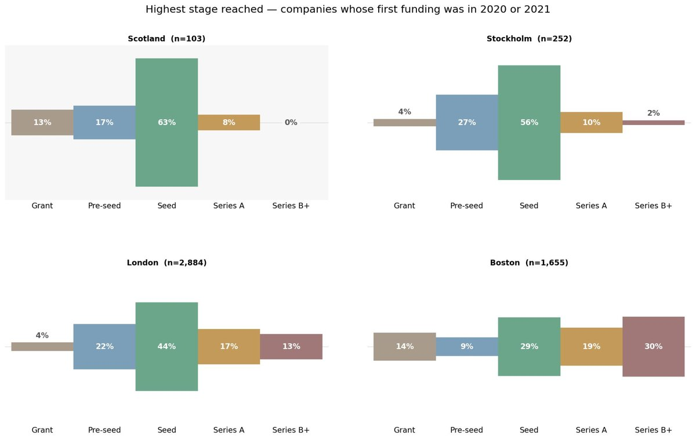
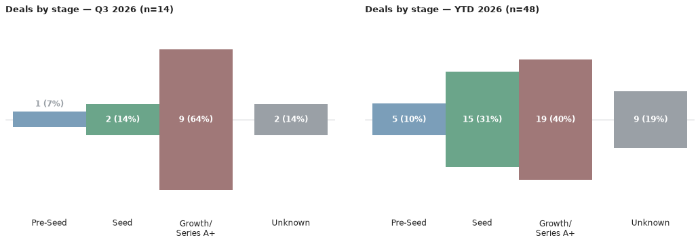
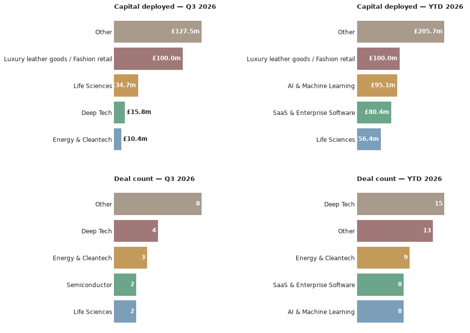

# Scottish Venture News — 5 October 2026

*This is an automated newsletter, written by Claude, based on news coverage scraped from 45 websites.*

## Editor's Note

Over the past few months, I've been looking at the Scottish startup and scaleup ecosystem with the intent of understanding why Scotland is so very good at producing startups but so poor at scaling them. 

A while ago I posted the results of an analysis on LinkedIn showing the highest stage that companies that show up in Crunchbase eventually go on to reach.

As you can see, Scotland does well up until Seed, but few companies progress to Series A and beyond. There are many potential structural reasons for this phenomenon. Most recently, I've been thinking about the role of community knowledge.

A little while ago, I was chatting to a serial startup operator and founder. We were comparing notes about his experience in San Francisco, mine in Boston, and how both differ from Scotland. They mentioned that when you do something as simple as going out for coffee in one of the more mature ecosystems, you could well get into a conversation with an experienced operator and subsequently learn a new thing or two. Over time, that retained community knowledge results in a sort of education by osmosis.

So last week, I was speaking with a successful founder who runs a thriving business but has not yet had their first exit. I asked them what it would take for them to be involved in mentoring up and coming entrepreneurs. They told me that once they'd exited, they'd enjoy being a non-exec, but as for being involved in the wider community, they saw little point. They didn't feel like there was much of an opportunity to make an impact because they didn't get much benefit from the community themselves.

Community knowledge is a missing piece in the Scottish ecosystem. Building a startup that becomes a scaleup requires a specific set of skills. Without adequate recycling of that expertise, it is very difficult for new entrepreneurs to learn how to think about their businesses, to know what questions to ask, how to find answers, what to look for when making early hires and what other help they need.

Keeping founders engaged with the community as they become successful is a real challenge. It's worth asking how we create communities that provide enough value at all stages of the journey that successful founders feel both willing and able to pass on their knowledge.

## What We Found This Month

- **Subsea Micropiles** (Aberdeen) landed an £8.15m package — a £6.7m commercial investment from the Scottish National Investment Bank plus a £1.45m Scottish Enterprise grant — to build a new offshore wind foundations facility at the Port of Montrose, 29 September 2026.
  *Source: [Scottish Enterprise Newsroom](https://www.scottish-enterprise-mediacentre.com/news/major-offshore-wind-expansion-at-port-of-montrose)*
- **SolarSub**, a University of Edinburgh spinout, raised a £1.34m seed round led by Sustainable Ventures, with Zinc VC, Scottish Enterprise, Old College Capital, SFC Capital and the British Business Bank also participating, 24 September 2026.
  *Source: [Edinburgh Innovations — News](https://edinburgh-innovations.ed.ac.uk/news/student-startup-solarsub-raises-1-3m-for-solar-panel-technology), [Crunchbase](https://www.crunchbase.com/discover/funding_rounds/e3120c30307a4df552a2e1c7559da4a2), [Scottish Enterprise Newsroom](https://www.scottish-enterprise-mediacentre.com/news/solarsub-announces-gbp-1-34-million-funding-round-to-advance-passive-solar-cooling-technology)*
- **CSignum**, the Bathgate-based underwater communications firm, closed a £2.6m round backed by Archangels, PXN Ventures, Scottish Enterprise, the British Business Bank and a group of US angels, alongside a CEO change, 23 September 2026.
  *Source: [Angel Capital Scotland](https://angelcapital.scot/deals/csignum-secures-2-6-million-to-accelerate-underwater-and-through-ground-monitoring-of-critical-infrastructure/), [PXN Ventures](https://www.pxnventures.co.uk/csignum-secures-2-6-million-for-underwater-and-through-ground-critical-infrastructure-monitoring/), [The Scotsman](https://www.scotsman.com/business/pivotal-moment-as-scottish-underwater-monitoring-scale-up-secures-ps26-million-9155255), [Scottish Enterprise Newsroom](https://www.scottish-enterprise-mediacentre.com/news/csignum-secures-gbp-2-6-million-to-accelerate-underwater-and-through-ground-monitoring-of-critical-infrastructure)*
- **iGii**, the Stirling deep-tech materials firm, secured £22.7m in combined funding, including an £11.7m Series B led by the Scottish National Investment Bank with PXN Ventures and Archangels also investing, plus £11m from Scottish Enterprise, 16 September 2026.
  *Source: [The Herald (Business)](https://www.heraldscotland.com/news/26542883.igii-secures-22-7m-amid-plans-scottish-expansion/?ref=rss), [Angel Capital Scotland](https://angelcapital.scot/deals/igii-secures-22-7m-as-it-targets-the-next-industrial-revolution-in-advanced-materials/), [Archangels](https://archangelsonline.com/igii-secures-22-7m-as-it-targets-the-next-industrial-revolution-in-advanced-materials/), [Scottish Financial Review](https://scottishfinancialreview.com/2026/09/16/igii-stirling-advanced-materials-firm-raises-23m/), [Crunchbase](https://www.crunchbase.com/discover/funding_rounds/e3120c30307a4df552a2e1c7559da4a2), [PXN Ventures](https://www.pxnventures.co.uk/igii-secures-22-7m-to-target-the-next-industrial-revolution/), [Scottish Enterprise Newsroom](https://www.scottish-enterprise-mediacentre.com/news/igii-secures-gbp-22-7m-as-it-targets-the-next-industrial-revolution-in-advanced-materials)*
- **Strathberry**, the Edinburgh luxury handbag brand, took a minority-stake growth investment from London's Soho Square Capital at a valuation of roughly £100m, with Soho Square director David Steel joining the board and BGF exiting the position it took in 2022, 8 September 2026.
  *Source: [Daily Business](https://dailybusinessgroup.co.uk/2026/09/soho-square-backs-strathberry-and-takes-board-seat/), [Crunchbase](https://www.crunchbase.com/discover/funding_rounds/e3120c30307a4df552a2e1c7559da4a2)*
- **Lentitek**, the Edinburgh cell and gene therapy manufacturing specialist, secured £725,000 led by Equity Gap alongside new and existing investors, as it moves from R&D into revenue, 7 September 2026.
  *Source: [Angel Capital Scotland](https://angelcapital.scot/deals/lentitek-strengthens-finances-as-commercial-traction-accelerates/)*
- **Mironid**, the Glasgow biopharmaceutical company, raised £34m in a Series B led by the Scottish National Investment Bank, with Roche Venture Fund, Epidarex Capital, Sofinnova Partners, BioGeneration Ventures, the University of Strathclyde and new investor the European Investment Fund also participating, to advance treatment for a rare kidney disease, 5 August 2026.
  *Source: [Mironid (company press release); also covered by DIGIT.fyi, Daily Business, Insider Media, thebusinessdesk.com, thebank.scot](https://mironid.com/2026/08/05/mironid-raises-46-million-in-series-b-financing-to-advance-clinical-development-of-its-treatment-for-rare-kidney-disease/)*

## The Numbers

Q4 2026 has just opened, so there's **0 deals** on the board for the new quarter so far. The year-to-date tally now stands at **48 deals worth £341.2m**, up from 41 deals worth £182.7m stated last issue — a jump of 7 deals and £158.5m, driven by this month's additions above: Strathberry's roughly £100m growth investment, iGii's £22.7m combined package, Mironid's £34m Series B (announced in August but only surfacing in coverage this cycle), and Subsea Micropiles' £8.15m facility backing, among others.

With no deals yet in Q4, there's no investor ranking to report this time. The charts above show the picture for Q3 2026, the most recent quarter with completed deals: Growth was the dominant stage, with Series B and Seed each appearing twice, and Deep Tech and Energy & Cleantech were the most active sectors, drawing repeat capital. The wide "Other" bucket — covering niche sectors like Strathberry's luxury leather goods — accounted for the largest share of capital, a function of that single £100m deal rather than a broad trend.

## Deal Spotlight

### Strathberry — Growth / Private equity (minority stake) — £100m (valuation)
**Lead investor**: Soho Square Capital · **Co-investors**: none named · **Sector**: Luxury leather goods / Fashion retail · **Location**: Edinburgh

Strathberry, the Edinburgh luxury handbag brand founded by Guy and Leeanne Hundleby, took on a minority-stake growth investment from London-based Soho Square Capital, valuing the business at roughly £100m. Soho Square director David Steel joins Strathberry's board as part of the deal. The investment marks the exit of previous backer BGF, which first invested in 2022 and helped the company more than quintuple revenues since. The new capital is earmarked for US expansion, including Strathberry's first store in New York. The Hundlebys retain control of the company.

Source: [Daily Business](https://dailybusinessgroup.co.uk/2026/09/soho-square-backs-strathberry-and-takes-board-seat/)

### iGii — Series B — £11.7m (part of a £22.7m combined package)
**Lead investor**: Scottish National Investment Bank · **Co-investors**: PXN Ventures, Archangels · **Sector**: Deep Tech · **Location**: Stirling

iGii, the Stirling-based maker of proprietary carbon nanomaterial Gii, secured a combined £22.7m to accelerate commercialisation and industrial adoption of its technology. The package splits into an £11.7m Series B led by the Scottish National Investment Bank, with PXN Ventures and Archangels also investing, plus £11m of separate Scottish Enterprise funding. The company positions its material as enabling a step change in advanced manufacturing applications. Seven separate outlets covered the round, including The Herald, Scottish Financial Review and Archangels' own site — one of the more widely-syndicated Scottish deals of the month.

Source: [The Herald (Business)](https://www.heraldscotland.com/news/26542883.igii-secures-22-7m-amid-plans-scottish-expansion/?ref=rss)

## Sources

- **Subsea Micropiles**: [Scottish Enterprise Newsroom](https://www.scottish-enterprise-mediacentre.com/news/major-offshore-wind-expansion-at-port-of-montrose)
- **SolarSub**: [Edinburgh Innovations — News](https://edinburgh-innovations.ed.ac.uk/news/student-startup-solarsub-raises-1-3m-for-solar-panel-technology), [Crunchbase](https://www.crunchbase.com/discover/funding_rounds/e3120c30307a4df552a2e1c7559da4a2), [Scottish Enterprise Newsroom](https://www.scottish-enterprise-mediacentre.com/news/solarsub-announces-gbp-1-34-million-funding-round-to-advance-passive-solar-cooling-technology)
- **CSignum**: [Angel Capital Scotland](https://angelcapital.scot/deals/csignum-secures-2-6-million-to-accelerate-underwater-and-through-ground-monitoring-of-critical-infrastructure/), [PXN Ventures](https://www.pxnventures.co.uk/csignum-secures-2-6-million-for-underwater-and-through-ground-critical-infrastructure-monitoring/), [The Scotsman](https://www.scotsman.com/business/pivotal-moment-as-scottish-underwater-monitoring-scale-up-secures-ps26-million-9155255), [Scottish Enterprise Newsroom](https://www.scottish-enterprise-mediacentre.com/news/csignum-secures-gbp-2-6-million-to-accelerate-underwater-and-through-ground-monitoring-of-critical-infrastructure)
- **iGii**: [The Herald (Business)](https://www.heraldscotland.com/news/26542883.igii-secures-22-7m-amid-plans-scottish-expansion/?ref=rss), [Angel Capital Scotland](https://angelcapital.scot/deals/igii-secures-22-7m-as-it-targets-the-next-industrial-revolution-in-advanced-materials/), [Archangels](https://archangelsonline.com/igii-secures-22-7m-as-it-targets-the-next-industrial-revolution-in-advanced-materials/), [Scottish Financial Review](https://scottishfinancialreview.com/2026/09/16/igii-stirling-advanced-materials-firm-raises-23m/), [Crunchbase](https://www.crunchbase.com/discover/funding_rounds/e3120c30307a4df552a2e1c7559da4a2), [PXN Ventures](https://www.pxnventures.co.uk/igii-secures-22-7m-to-target-the-next-industrial-revolution/), [Scottish Enterprise Newsroom](https://www.scottish-enterprise-mediacentre.com/news/igii-secures-gbp-22-7m-as-it-targets-the-next-industrial-revolution-in-advanced-materials)
- **Strathberry**: [Daily Business](https://dailybusinessgroup.co.uk/2026/09/soho-square-backs-strathberry-and-takes-board-seat/), [Crunchbase](https://www.crunchbase.com/discover/funding_rounds/e3120c30307a4df552a2e1c7559da4a2)
- **Lentitek**: [Angel Capital Scotland](https://angelcapital.scot/deals/lentitek-strengthens-finances-as-commercial-traction-accelerates/)
- **Mironid**: [Mironid (company press release); also covered by DIGIT.fyi, Daily Business, Insider Media, thebusinessdesk.com, thebank.scot](https://mironid.com/2026/08/05/mironid-raises-46-million-in-series-b-financing-to-advance-clinical-development-of-its-treatment-for-rare-kidney-disease/)

## Notes

Mironid's £34m Series B was announced back on 5 August but only came to light in our coverage this cycle — it's counted in this month's totals for that reason, not because of any lull in deal activity between early August and now; see The Numbers above for the actual run-rate.
