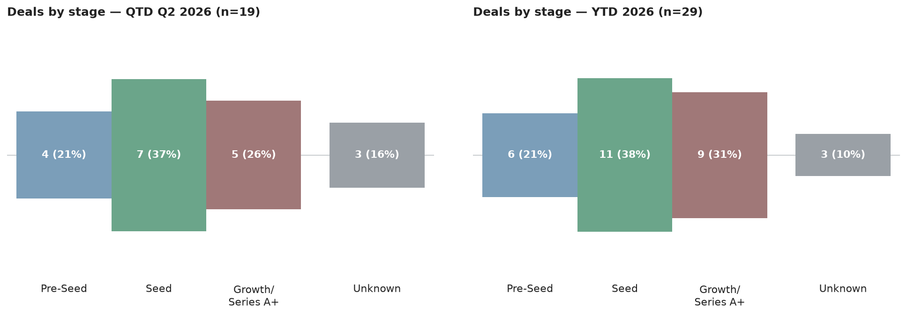

# Scottish VC Tracker — 22 June 2026

## This Week

It's a quiet week on the Scottish deal front — nothing new has surfaced since last issue, and the totals below are unchanged from 15 June.

## The Numbers

Q2 2026 stands at **19 deals worth £107.5m**; year-to-date, Scotland has seen **29 deals totalling £141.6m**. Both figures are flat against last week's issue — no deals or capital to add or revise this time.

Tricapital remains the most active investor by deal count this quarter, backing four companies (HonuWorx, Kaly, Sisaltech, and JET Connectivity) for a combined £2.76m — a striking contrast to the typical cheque size at the top of the capital table. Scottish Enterprise Investment Fund is the next most active by count, with three deals worth £22.5m, while Maven Capital Partners and STAC Invest are tied on two deals apiece. By capital deployed, Index Ventures and Highland Europe are tied at the top with £51.9m each, both via the same deal — Wordsmith AI's Series B — ahead of Scottish Enterprise Investment Fund's £22.5m and a further tie between the Scottish National Investment Bank and Thairm Bio at £19m each.

Seed remains the dominant stage this quarter with seven deals, followed by Pre-Seed and Growth at four each; deep tech leads the sector mix with six deals, ahead of life sciences (four) and SaaS/enterprise software and AI/machine learning (three each). Edinburgh continues to draw the bulk of activity with eight deals, against four in Glasgow and five spread across the rest of Scotland.

## Notes

Bead BioPharma's stealth-mode emergence is still unconfirmed as a funding event — Archangels' backing is established, but no specific round or amount has been disclosed, so it stays out of the capital totals above. A handful of this quarter's deals also carry sector labels outside the standard taxonomy (Sisaltech's low-carbon insulation work and Infrawatch's cybersecurity platform among them) — worth flagging if either space starts seeing repeat activity, since neither maps cleanly to existing categories yet.
